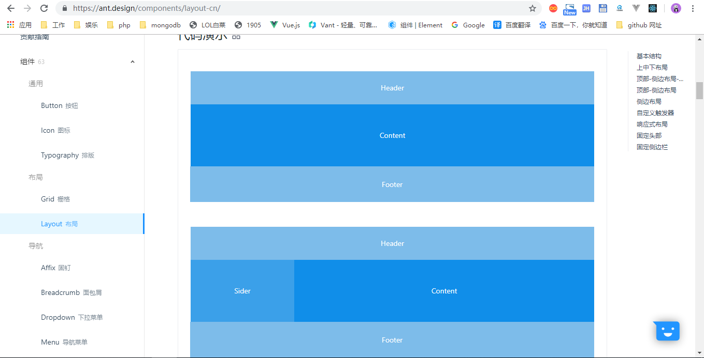

# dva

目录结构

- mock 模拟数据文件
- node_modules 第三方模块
- public index.html 首页模板
- src webpack入口文件夹，我们前端所有的开发都在这边进行
  - assets 你需要打包进项目的图片
  - components 公共组件，复用组件
  - models 状态管理 相当于Vuex
  - router 路由
  - services 服务(定位功能，支付功能)
  - utils ajax的方法，封装好cookie和本地存储(localstorage和sessionstorage)
  - index.css 全局样式
  - index.js 入口文件
  - package.json 描述


# 后台管理系统

数据的处理，学生后台管理系统

数据的增删查改

# Antd

[官方文档](https://ant.design/docs/react/introduce-cn)

注意引入全局样式
```js
import 'antd/dist/antd.css';
```

先布局，



去路由页面修改

# 路由

react库，任何，没有完整固定规范，就是写法很自由

react-router不是官方提供

redux不是官方提供

[react-router](https://github.com/ReactTraining/react-router)

```
react.js 虚拟DOM 后端完成
react-dom 虚拟DOM挂载真实DOM 提供给前端
```
新版本里面`react-router-dom`已经包含了`react-router`的核心
```
npm install react-router-dom
```
在`views`文件夹里面定义`Home`和`Mine`路由组件，引入`<Router/>`组件，相当于`<router-view></router-view>`，放哪里哪里就有路由，`<Link>`相当于`<a></a>`标签，做声明式导航，`<Route></Route>`定义路由规则
```js
import React from 'react';
import './App.css';
import { BrowserRouter as Router, Route, Link } from "react-router-dom";
// 路由组件
import Home from './views/Home/Home'
import Mine from './views/Mine/Mine'

function App() {
  return (
    <Router>
      <Link to="/">Home</Link>
      <Link to="/mine">Mine</Link>
      <div className="App">
        <Route path="/" exact component={Home} />
        <Route path="/mine" component={Mine} />
      </div>
    </Router>
  );
}

export default App;
```

```js
<Route path="/" exact component={Home} />
<Route path="/mine" component={Mine} />
```
上面两句的意思就是，当`url`匹配到路由为`/`，就在这个位置加载`Home`组件，如果匹配到`/mine`，那就加载`Mine`组件，如果你是`/`的话，你需要加上`exact`属性，因为`/mine`既匹配`/`也匹配`/mine`这两个路由。